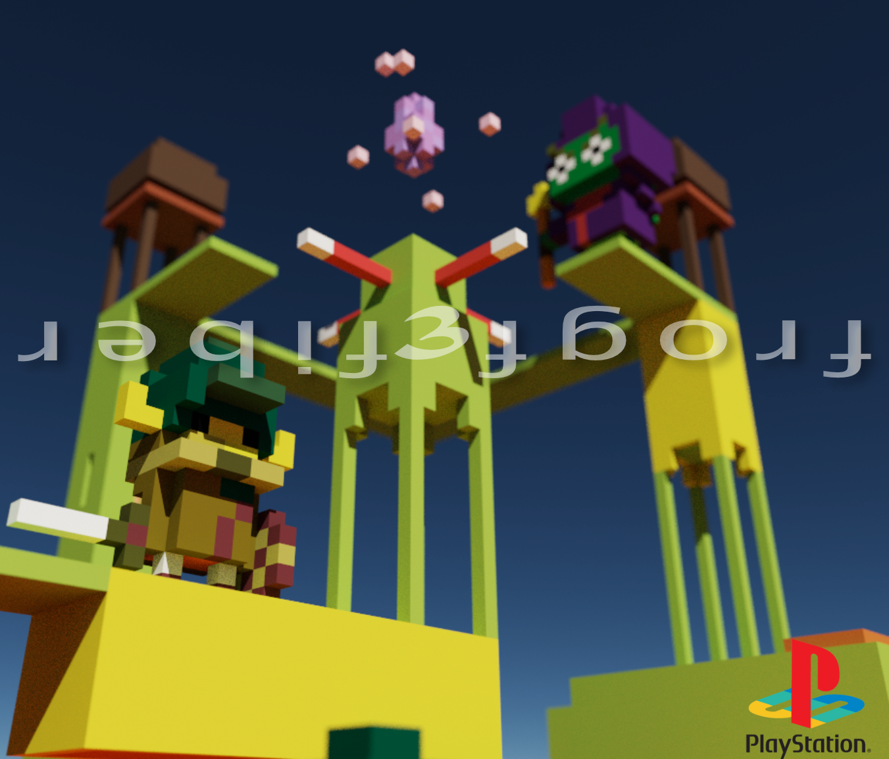
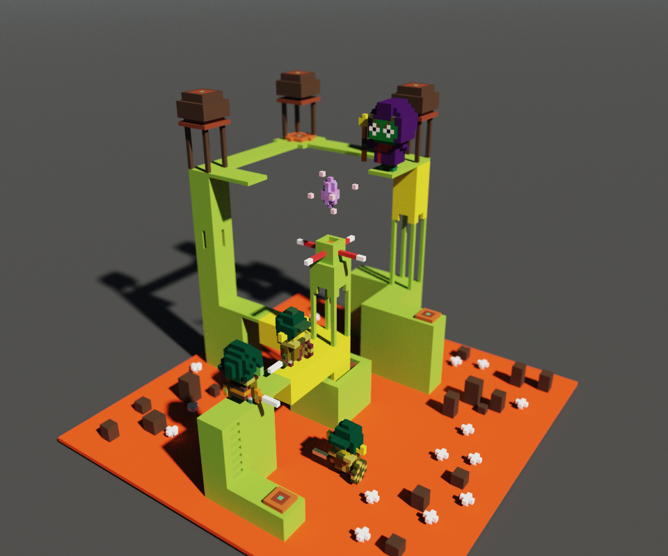
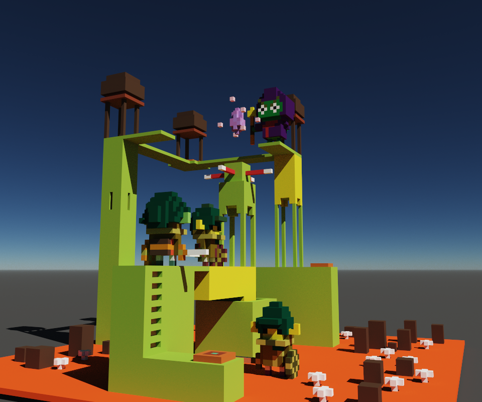
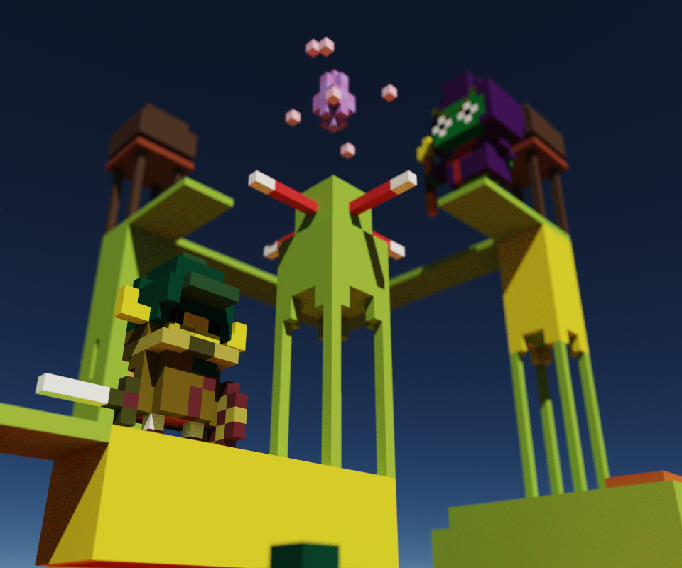

# `welcome to frogf3fiber`

### Ribbit! Hello! 
#### You're looking in the right place! However, this project is under construction. Check back soon ❤️
 

#### You can hear the original soundtrack here: [Froge Wizard Soundtrack](https://www.dropbox.com/s/g06mw9lmvlpkfs6/FROGE%20WIZARD.mp3?dl=0)

 

 
<!--   -->
<!--   -->
<!--   -->

 

##### _On the eighth of May, 2020_
#### _From the imagination of_ _Jeremy Kale Padot,_ frogf3fiber is a three.js react three fiber animation about a frog.

###### For macOS:
_If Homebrew is not installed on your computer already, then install Homebrew by entering the following two commands in Terminal:_
* $ /usr/bin/ruby -e "$(curl -fsSL https://raw.githubusercontent.com/Homebrew/install/master/install)"
* $ echo 'export PATH=/usr/local/bin:$PATH' >> ~/.bash_profile

_Install Git with the following command:_
* $ brew install git

_Next, install Node.js by entering the following command in Terminal:_
* $ brew install node

###### For Windows:
_Please visit the [Node.js website](https://nodejs.org/en/download/) for installation instructions._

#### Install this application

_Clone this repository via Terminal using the following commands:_
* _$ cd desktop_
* _$ git clone {url to this repository}_
* _$ cd frogf3fiber
_Then, confirm that you have navigated to the music-shop project directory by entering "pwd" in Terminal._

_Next, install npm at the project's root directory via the following commands:_
* _$ npm install_
* _$ npm run build_
 ### I feel like yarn works better with r3f, instead try: yarn install, yarn start to run the applicaion 
_Open the contents of the directory in a text editor or IDE of your choice (e.g., to open the contents of the directory in Visual Studio Code on macOS, enter the command "code ." in Terminal)._

## Available Scripts

In the project directory, you can run:

### `npm start` or `yarn start`

Runs the app in the development mode. 
Open [http://localhost:3000](http://localhost:3000) to view it in the browser.

The page will reload if you make edits. 
You will also see any lint errors in the console.

## Controls:
 
* Use the directional pad (up down left right) to move the goblins around the screen
* Use your mouse to click, hold, drag, and zoom the froge platform 

#### Technologies:
* React
* React-three-fiber
* Three.js
* Blender
* Adobe
* Illustrator
* Affinity
* JavaScript
* MagicaVoxel
* Git

#### License:

[MIT](https://choosealicense.com/licenses/mit/)

Copyright (c) 2020 **_Jeremy Padot_**